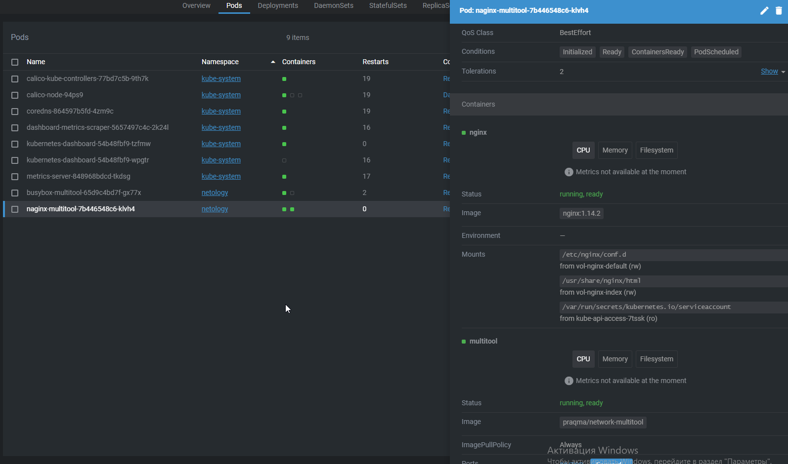
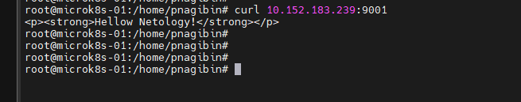
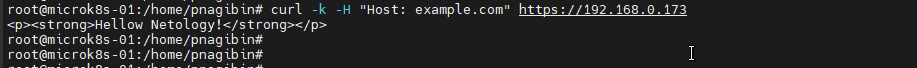

# Домашнее задание к занятию «Конфигурация приложений»

### Цель задания

В тестовой среде Kubernetes необходимо создать конфигурацию и продемонстрировать работу приложения.

------

### Чеклист готовности к домашнему заданию

1. Установленное K8s-решение (например, MicroK8s).
2. Установленный локальный kubectl.
3. Редактор YAML-файлов с подключённым GitHub-репозиторием.

------

### Инструменты и дополнительные материалы, которые пригодятся для выполнения задания

1. [Описание](https://kubernetes.io/docs/concepts/configuration/secret/) Secret.
2. [Описание](https://kubernetes.io/docs/concepts/configuration/configmap/) ConfigMap.
3. [Описание](https://github.com/wbitt/Network-MultiTool) Multitool.

------

### Задание 1. Создать Deployment приложения и решить возникшую проблему с помощью ConfigMap. Добавить веб-страницу

1. Создать Deployment приложения, состоящего из контейнеров nginx и multitool.
2. Решить возникшую проблему с помощью ConfigMap.
3. Продемонстрировать, что pod стартовал и оба конейнера работают.



4. Сделать простую веб-страницу и подключить её к Nginx с помощью ConfigMap. Подключить Service и показать вывод curl или в браузере.
5. Предоставить манифесты, а также скриншоты или вывод необходимых команд.

```
apiVersion: apps/v1
kind: Deployment
metadata:
  name: naginx-multitool
spec:
  selector:
    matchLabels:
      app: naginx-multitool
  replicas: 1 # tells deployment to run 2 pods matching the template
  template:
    metadata:
      labels:
        app: naginx-multitool
    spec:
      containers:
      - name: nginx
        image: nginx:1.14.2
        volumeMounts:
        - name: vol-nginx-default
          mountPath: /etc/nginx/conf.d
        - name: vol-nginx-index
          mountPath: /usr/share/nginx/html
      - name: multitool
        image: praqma/network-multitool
        ports:
        - containerPort: 80
      volumes:
      - name: vol-nginx-default
        configMap:
          name: conf-nginx-default
      - name: vol-nginx-index
        configMap:
          name: conf-nginx-index
---
apiVersion: v1
kind: ConfigMap
metadata:
  name: conf-nginx-default
data:
  default.conf: |
    server {
      listen       8080;
      server_name  localhost;

      location / {
          root   /usr/share/nginx/html;
          index  index.html index.htm;
      }

      error_page   500 502 503 504  /50x.html;
      location = /50x.html {
          root   /usr/share/nginx/html;
      }
    }
---
apiVersion: v1
kind: ConfigMap
metadata:
  name: conf-nginx-index
data:
  index.html: |
    <p><strong>Hellow Netology!</strong></p>
---
apiVersion: v1
kind: Service
metadata:
  name: nginx-svc
spec:
  ports:
  - name: http
    port: 9001
    targetPort: 8080
    protocol: TCP
  selector:
    app: naginx-multitool
```

curl



------

### Задание 2. Создать приложение с вашей веб-страницей, доступной по HTTPS 

1. Создать Deployment приложения, состоящего из Nginx.
2. Создать собственную веб-страницу и подключить её как ConfigMap к приложению.
3. Выпустить самоподписной сертификат SSL. Создать Secret для использования сертификата.
4. Создать Ingress и необходимый Service, подключить к нему SSL в вид. Продемонстировать доступ к приложению по HTTPS. 
4. Предоставить манифесты, а также скриншоты или вывод необходимых команд.

```
apiVersion: apps/v1
kind: Deployment
metadata:
  name: naginx
spec:
  selector:
    matchLabels:
      app: naginx
  replicas: 1 # tells deployment to run 2 pods matching the template
  template:
    metadata:
      labels:
        app: naginx
    spec:
      containers:
      - name: nginx
        image: nginx:1.14.2
        volumeMounts:
        - name: vol-nginx-default
          mountPath: /etc/nginx/conf.d
        - name: vol-nginx-index
          mountPath: /usr/share/nginx/html
      volumes:
      - name: vol-nginx-default
        configMap:
          name: conf-nginx-default
      - name: vol-nginx-index
        configMap:
          name: conf-nginx-index
---
apiVersion: v1
kind: ConfigMap
metadata:
  name: conf-nginx-default
data:
  default.conf: |
    server {
      listen       8080;
      server_name  localhost;

      location / {
          root   /usr/share/nginx/html;
          index  index.html index.htm;
      }

      error_page   500 502 503 504  /50x.html;
      location = /50x.html {
          root   /usr/share/nginx/html;
      }
    }
---
apiVersion: v1
kind: ConfigMap
metadata:
  name: conf-nginx-index
data:
  index.html: |
    <p><strong>Hellow Netology!</strong></p>
---
apiVersion: v1
kind: Service
metadata:
  name: nginx-svc
spec:
  ports:
  - name: http
    port: 9001
    targetPort: 8080
    protocol: TCP
  selector:
    app: naginx
---
apiVersion: v1
kind: Secret
metadata:
  name: example-tls
type: kubernetes.io/tls
data:
  tls.crt: |
    LS0tLS1CRUdJTiBDRVJUSUZJQ0FURS0tLS0tCk1JSUQ4VENDQXRtZ0F3SUJBZ0lVV3RaWGIwcExk
    bWhuVW9ZYmVzNXg2ampybkU4d0RRWUpLb1pJaHZjTkFRRUwKQlFBd2dZWXhDekFKQmdOVkJBWVRB
    bEpWTVE4d0RRWURWUVFJREFaTmIzTmpiM2N4RFRBTEJnTlZCQWNNQkdOcApkSGt4RVRBUEJnTlZC
    QW9NQ0VodmJXVWdUR0ZpTVEwd0N3WURWUVFMREFSU2IyOXRNUlF3RWdZRFZRUUREQXRsCmVHRnRj
    R3hsTG1OdmJURWZNQjBHQ1NxR1NJYjNEUUVKQVJZUWJXRnBiRUJsZUdGdGNHeGxMbU52YlRBZ0Z3
    MHkKTXpFeU1UY3hNREl5TVRGYUdBOHlNRFV4TURVd016RXdNakl4TVZvd2dZWXhDekFKQmdOVkJB
    WVRBbEpWTVE4dwpEUVlEVlFRSURBWk5iM05qYjNjeERUQUxCZ05WQkFjTUJHTnBkSGt4RVRBUEJn
    TlZCQW9NQ0VodmJXVWdUR0ZpCk1RMHdDd1lEVlFRTERBUlNiMjl0TVJRd0VnWURWUVFEREF0bGVH
    RnRjR3hsTG1OdmJURWZNQjBHQ1NxR1NJYjMKRFFFSkFSWVFiV0ZwYkVCbGVHRnRjR3hsTG1OdmJU
    Q0NBU0l3RFFZSktvWklodmNOQVFFQkJRQURnZ0VQQURDQwpBUW9DZ2dFQkFObGJDQjROVjNkanR4
    WnpPMEFHeWw1bEdoaVdCcStsNU9ITytLWkhGa0t4Z3dkenkrdFpPcUNQCjNySlJNWEhveEFhOGN6
    NmFqanZsR2ZJcFErTS9yWENUejJXbEN0UTBVd0dwd3FTWmRSWTV6RDcwUXRzZzFPOUwKL05LdDdM
    VDlqa1U1NVJ5c3o1b2ZITUw5QjZOc0xWajRDQ1lSWXl2Y05DZzVOTjZlRkl2UVVMbmU0UTRGQ21T
    bgppNk9SaDlINyswSHRoZkJycjhCTFVtbHhmM0tndDcwa2JnSStBTU80MEFsNXdwem9oV1Eyd0pP
    K0Eya3ZqTlVUCmNvbXFQVmRSd1kzU0RwVy8wQmlSdnVBMzVlbUxrYisybHJIeHg3RkllNG8yeFpj
    NWVjejJPbTlrblBtdmdDRnkKb3VJT3h0SkxaOTMvSGxmN0JSMHNVUGdzRmdpdmRuRUNBd0VBQWFO
    VE1GRXdIUVlEVlIwT0JCWUVGRTZrOHByawpUWHNiUGk4OWZxWnNsYlB0UlZxQ01COEdBMVVkSXdR
    WU1CYUFGRTZrOHBya1RYc2JQaTg5ZnFac2xiUHRSVnFDCk1BOEdBMVVkRXdFQi93UUZNQU1CQWY4
    d0RRWUpLb1pJaHZjTkFRRUxCUUFEZ2dFQkFNeE0rMVNHOHJXUXZnY0sKRXdNcWFhb1Zhc1gyc1N2
    ck5BNk03V2c4NlI3NFFGYndHTE9mK0sxZ3NlQ0creUNBaGZvaURpcEVDU3MwOCtlTQpMUDBTVDBT
    emxjU1NXSk94b1U2clJQQjBvZWxQQklyZ0JiRCtxRi8yUS9POU9CbEtITkszZS9xUHpNRlNkQWtn
    CkhVMEloVERhWWxlYzBTVllkM0xmUmpnWWtGcVg3c3B5Rlc3M2U4ZUFkc0xHQ29xOE93cU5pYkFk
    RUVsMFVSZzkKZ0JqWFFwTjhkYTRkNlRkcVFQKzF3T3VGMlovWnVmRTZtaHNSZm9ONkFIekRycGtk
    aFdEeUFUMjNELytOSU9udwppVURsbnZZQXBQMkxGVnlmSUlSWlRIc1IrRlp5eGQrZlB5emJaaHZt
    TlZ5WlUzWjdNYU1CcElKWWRrdUY2MDArCnNjZWpDVm89Ci0tLS0tRU5EIENFUlRJRklDQVRFLS0t
    LS0K
  tls.key: |
    LS0tLS1CRUdJTiBQUklWQVRFIEtFWS0tLS0tCk1JSUV2UUlCQURBTkJna3Foa2lHOXcwQkFRRUZB
    QVNDQktjd2dnU2pBZ0VBQW9JQkFRRFpXd2dlRFZkM1k3Y1cKY3p0QUJzcGVaUm9ZbGdhdnBlVGh6
    dmltUnhaQ3NZTUhjOHZyV1RxZ2o5NnlVVEZ4Nk1RR3ZITSttbzQ3NVJueQpLVVBqUDYxd2s4OWxw
    UXJVTkZNQnFjS2ttWFVXT2N3KzlFTGJJTlR2Uy96U3JleTAvWTVGT2VVY3JNK2FIeHpDCi9RZWpi
    QzFZK0FnbUVXTXIzRFFvT1RUZW5oU0wwRkM1M3VFT0JRcGtwNHVqa1lmUisvdEI3WVh3YTYvQVMx
    SnAKY1g5eW9MZTlKRzRDUGdERHVOQUplY0tjNklWa05zQ1R2Z05wTDR6VkUzS0pxajFYVWNHTjBn
    NlZ2OUFZa2I3ZwpOK1hwaTVHL3RwYXg4Y2V4U0h1S05zV1hPWG5NOWpwdlpKejVyNEFoY3FMaURz
    YlNTMmZkL3g1WCt3VWRMRkQ0CkxCWUlyM1p4QWdNQkFBRUNnZ0VBWnNMWG1TRzBweUR4T0Q5OWxU
    MUFveFZJbTdRZWNCL09FUVpCMzVjL1NvUFQKVDR3ckxsZE8xUWVBQWExS1k3RHBNTWdhOGsrdkRG
    azZCWmdGM1NSSGN6Q212c2NqVWdWMDh4WFlET3J5aFBJSgpnd0FIdGNNVmVSZGpiaFhGa2lKSWg2
    a2lEWWNVVmFqODk2RWFZZVNzb2VJT05EVkhQajdMTi9NbjhGSXJvNWVYCjV2SmR3WFVTbGEwOGpQ
    VTlpd1ZPMStKeCtYSnRtMm5icGVleERrNk1qLzVDZjJ0czZnRzR0MEttcmx5SHVJbVQKc3NYMlJz
    bzRsNlhoOUxBa3NyQU56dSthZSs3YXAwSTIzTWpJc2luSHZkU3FTbWhjV01jNnNBZnB3aENOTmp6
    NQpOcXRWNEFVQUhkVElGUUVacGVwcXdLSHY1MUdRanVDVmxSTjVua2ZCV3dLQmdRRG9HT0w5bVFS
    Tktrd3kyRzB2CnJOUGxIdURpSHhrd21mVk5XUU5ub0l5OHhjOHJmTU5XTW9ITXZYNGpsU2NuV21S
    UlgrTkRDSWdEcTNHZlU0UngKWmhoWlFObCt0YmRKK2wyekhnL2xYazNkVVc4aStGL3dJV2NxbUpq
    bTI5VStOMmpiNWRrY1FrazFKU1RPTldhUQpVVWZWejZXN0VULzdPakovbGN3SFFJUTFNd0tCZ1FE
    dnZYMk1zbnFyRFo1V3g3TEh5aisybmJjL1JaSjRiUFlvCk91UUxZdEtVL21ndUs0M1hEMHB1YTZM
    dmJ3b1B4Qkh4cGJmM203WnUrZ2VhSDQvbWxMd3lzUVhSd2ZDSXJhY1QKU2hmTHhoRnNvckR0SGRq
    Q0xKZTd2U0pteTBUWHBvbXJFSStxcE9TdXh4ckdkZ3JlMnJVeXRieE5jUHJJVUc2bgphVGRCNWVP
    ZHl3S0JnQ1U5K1E1Z1EwUnVpUk9QanRXYmtkU3VBNy9FNWJIYXduWEsxclVHR2c4Z1hvSEgzMEF4
    CmtvcGJ6YVhBQlN4WFlNbDk3V1dRTk9NQjI1V0pQVE5GQXBzdndMYUlTZ1RnMjdBbUhyN2JSdnRB
    V2VqdW1kWmEKUmNlYi9NenVjV1V1VnZFU0RLaHdLbmNRb3J0RDdsVXg5YWpsVE42YmdmeTU5ZWhy
    RFBZTThDbnBBb0dBYmVLbAo1RkorWlY3MW40TWpEKzVFNjlnNGdQakxuUVVjZ3U0VFRxQzZNdTYx
    STh4MDFBay9MWU9LaUVLV0V3bmt5NlVRCndKNlByU2hQU2JhRHg4V095WkZZUUgrclY0cDQxUitW
    N3FIWHBMcWhhOTNOVjVzRzVWZFlxRk10TjhjdXZNajMKZ05qWnRMNndLQjA4K0U2NDFRaDF5ZTBx
    Rlp6QVMxMnZwVFhROGFjQ2dZRUE0bHBEY3hWamZpQVp4cUwrVis4RgpzSThzOEsvSUhGbWQwZ1BZ
    S0Y3eldqVTBDbUFFTXU0UDNQSHdYVDFXc1hVMWpKTzQ2UERyTmRlOGRnRWxnYVdsClhDNmdiZy9z
    T1c2SW9PMHNGcUpmSGJxN0JYeUp0UGQzbUplSWFpblB0UUlyUGZLelVWVlVCemRMQVkvdWtkOVQK
    Mm51WFhhcFpyY2N6czlXRExSMFlNTE09Ci0tLS0tRU5EIFBSSVZBVEUgS0VZLS0tLS0K
---
apiVersion: networking.k8s.io/v1
kind: Ingress
metadata:
  name: nginx-ingress
  annotations:
    nginx.ingress.kubernetes.io/rewrite-target: /$1
    nginx.ingress.kubernetes.io/use-forwarded-headers: "true"
spec:
  tls:
  - hosts:
    - example.com
    secretName: example-tls
  rules:
    - host: "example.com"
      http:
        paths:
          - path: /
            pathType: Prefix
            backend:
              service:
                name: nginx-svc
                port:
                  number: 9001
  
```

curl




------

### Правила приёма работы

1. Домашняя работа оформляется в своём GitHub-репозитории в файле README.md. Выполненное домашнее задание пришлите ссылкой на .md-файл в вашем репозитории.
2. Файл README.md должен содержать скриншоты вывода необходимых команд `kubectl`, а также скриншоты результатов.
3. Репозиторий должен содержать тексты манифестов или ссылки на них в файле README.md.

------
